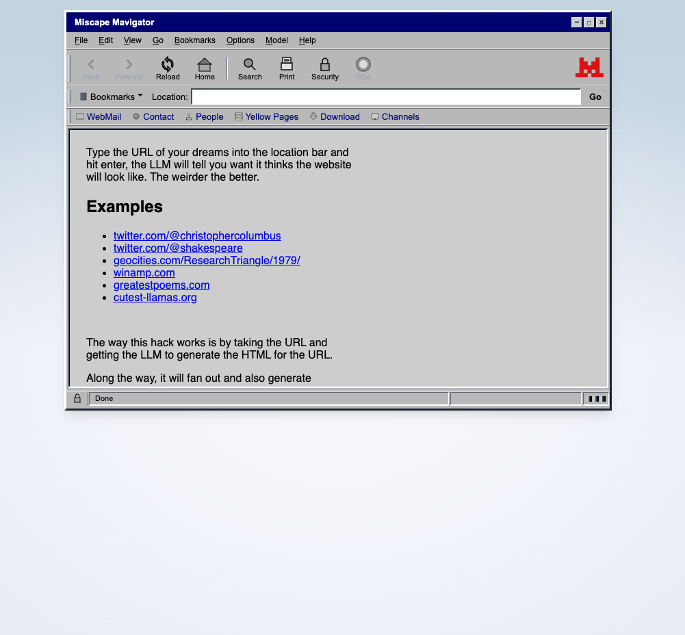

# Browsing an LLM

Hackathon prototype for the [Mistral AI Hackathon 2026 in Tokyo](https://luma.com/mistralhack-tokyo?tk=FjQyv5) by [Alastair Tse](https://liquidx.net/)

Imagine a browser for an LLM. Every page is just from conjured up by Mistral models.

[https://liquidx-tokyo-mistral.vercel.app](https://liquidx-tokyo-mistral.vercel.app)

---

## Concept

At the beginning of the web, the only interface we had was a browser (Netscape) and
that was the only way we could view what was on the web.

It would be fun if we could have a browser for an LLM. Every URL you type into the
box is then imagined by the LLM, from the HTML to the styling to the images. Nothing
is fetched online.

## Overall Structure

The project is a SvelteKit project and all self contained.

The UI consists of a BrowserFrame that surrounds an iframe. The iframe loads the generated HTML page.

The page itself is generated and then encoded into a `data:` URI and loaded into the frame. This simplifies the implementation as it doesn't require any file hosting. After the page is loaded, an async function is called to look for any images and replace them with generated SVGs from the LLM.

For image generation, initially I had used Mistral's image generation tools but it was slow and also cost was too high. So I switched to using SVG generation which has a lower quality but also more consistent with having it look at what the LLM had inside.

## Prompting & Context

When the user types in a URL, we simply use the URL as the prompt along with some styling guidance and rules (eg. no js, inline styles, etc.)

It gets a bit more complex with we handle links. To make the links work well, we give the previous page HTML and URL as context to the LLM so that it can generate a plausible continuation of the page.

## User Interface

The BrowserFrame UI is a svelte component that includes toolbars inspired by the
old Netscape Navigator UI. The button images are vibe-coded replicas of similar buttons
but using SVG.

As a fun touch, using Mistral Vibe we made a custom loading spinner that is displayed
while the page is loading.



## Development

This project is deployed to Vercel.

To run locally, you need to set the following environment variables:

```bash
MISTRAL_API_KEY="your-mistral-api-key"
```

Then run:

```bash
pnpm run dev
```
